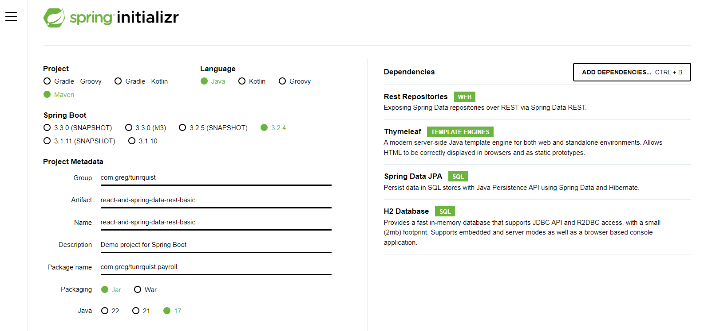

# Class Assignment 2 - Part 2 - Build Tools With Gradle

## Introduction:
This assignment was introduced to the class within the DEVOPS discipline within the Switch course.
The following tutorial will provide a detailed walkthrough of the assignment, however it must be noted that it required
the creation of a local personal [repository](https://github.com/hugosousa1231830/devops-23-24-JPE-PSM-1231830).

The assignment will be tagged along the way, following this format: Tag v.assignmentNumber.part.section. For example, the
first Tag will be 2.2.0 - Which means assignment 2, part 2, section 0.

NOTE: Some commands such as mkdir, cd, tag and commit+push will be abstracted as they were covered in the previous assignment.

## Table of Contents
1. [Part 2](#part-2)
    1. [Arranging the project structure](#arranging-the-project-structure)
    2. [Adding the frontend support](#adding-the-frontend-support)
    3. [Adding the copyJar task](#adding-the-copyjar-task)
    4. [Adding the deleteWebpackFiles task](#adding-the-deletewebpackfiles-task)
    5. [Merging the branches](#merging-the-branches)
    6. [Alternative solution - Utilizing maven](#alternative-solution---utilizing-maven)
   
## Overview
This assignment will be divided into three parts. The first part will consist of adding a new task to the build.gradle file.
The second part will consist of adding a test class and a unit test. The third part will consist of adding a new task of the type
Copy.

# Arranging the project structure 

1. First, I created a new branch called tut-basic-gradle. To create a branch
```bash
git checkout -b tut-basic-gradle
```
2. Generated the project using https://start.spring.io with the following dependencies: Rest Repositories; Thymeleaf; JPA; H2.

3. Extracted the generated zip file inside the folder ”CA2/Part2/” of the repository. To unzip to the desired folder, I used the command:
```bash
unzip -d CA2/Part2/ react-and-spring-data-rest-basic.zip
```

4. Delete the src folder from CA2-part2. Copy the contents of the src folder from CA1 into the src folder of CA2-part2.
   Copy the webpack.config.js and package.json files from CA1 into the CA2-part2 folder. Delete the main/resources/static/built
   folder as it should be generated by the webpack tool.

5. Use ./gradlew bootRun to run the application. The web page http://localhost:8080 is empty as gradle is missing the
   plugin for dealing with the frontend code.

# Adding the frontend support
6. Open the build.gradle file and add the frontend plugin:
```gradle
 id "org.siouan.frontend-jdk17" version "8.0.0"
```
This plugin allows Gradle to manage the frontend code in the project.

7. Configure the plugin by adding the following code to the build.gradle file:
```gradle
frontend {
nodeVersion = "16.20.2"
assembleScript = "run build"
cleanScript = "run clean"
checkScript = "run check"
}
```
This code configures the frontend plugin to use Node.js version 16.20.2 and specifies the scripts to be executed during
the build, clean, and check phases.

8. Add the dependencies in the build.gradle file:
```gradle
"scripts": {
"webpack": "webpack",
"build": "npm run webpack",
"check": "echo Checking frontend",
"clean": "echo Cleaning frontend",
"lint": "echo Linting frontend",
"test": "echo Testing frontend"
},
```
These scripts define the commands to be executed during the build, check, clean, lint, and test phases of the frontend
build process. Notice that this dependency relates to step 7 configuration.

9. With the frontend plugin configured, execute ./gradlew build to ensure all tasks related to the frontend
   are executed, then run the command ./gradlew bootRun to start the application. It will now be able to manage the frontend code.

# Adding the copyJar task

10. Open the build.gradle file and add the following task:
```gradle
task copyJar(type: Copy) {
from 'build/libs/'
description "Copies .jar file to dist folder"
into 'dist'
include '*.jar'
}
```
This task serves the purpose of copying the generated Jar file to a folder named dist.
It is to note that this task is not dependent on any other task, and will not be executed automatically.
For it to be done so, it should be added as a dependency to another task, such as the build task.

11. To run the task independently, execute the command:
```bash
./gradlew copyJar
```

# Adding the deleteWebpackFiles task

12. Open the build.gradle file and add the task:
```gradle
task deleteWebpackFiles(type: Delete) {
description "Deletes the files generated by webpack"
delete 'src/main/resources/static/built'
}
```
This task deletes the files generated by the webpack tool in the src/main/resources/static/built folder.

14. Add the following command to make sure this task is executed automatically by the task clean:
```gradle
clean.dependsOn(deleteWebpackFiles)
```
Opposite to the task copyJar who needs to be run independently, this task is dependent
on the clean task, and will be executed automatically when the clean task is run.

# Merging the branches 

15. To merge the tut-basic-gradle branch into the master branch, execute the following commands:
```bash
git checkout master
git merge --no-ff tut-basic-gradle
git push
```

## Alternative solution - Utilizing maven

An alternative solution to the assignment would be to use Maven as the build automation tool instead of Gradle.
Maven, relying on XML configuration, follows strict conventions with a predefined project structure and lifecycle phases, 
centralizes dependency management to a repository, and provides a wide array of plugins. Gradle, in contrast, offers 
flexibility with Groovy or Kotlin DSL, allows customization without strict conventions, supports dynamic version resolution, 
multiple repositories, and efficient incremental builds. The choice between them often boils down to project needs and team 
preferences. The steps to implement the changes using Maven would be:

1. Visit the Spring Initializr website and generate a new Maven project with the required dependencies: Rest Repositories, Thymeleaf, JPA, H2.
https://start.spring.io/ 

2. Visit https://github.com/eirslett/frontend-maven-plugin and follow the instructions to add the frontend-maven-plugin to the pom.xml file.
```xml
<plugin>
   <groupId>com.github.eirslett</groupId>
   <artifactId>frontend-maven-plugin</artifactId>
   <version>1.11.0</version>
   <executions>
      <!-- Install Node and NPM -->
      <execution>
         <id>install node and npm</id>
         <goals>
            <goal>install-node-and-npm</goal>
         </goals>
         <configuration>
            <nodeVersion>v16.20.2</nodeVersion>
            <npmVersion>8.1.0</npmVersion>
         </configuration>
      </execution>
      <!-- Run npm install -->
      <execution>
         <id>npm install</id>
         <goals>
            <goal>npm</goal>
         </goals>
         <configuration>
            <arguments>install</arguments>
         </configuration>
      </execution>
      <!-- Run npm run build -->
      <execution>
         <id>npm run build</id>
         <goals>
            <goal>npm</goal>
         </goals>
         <configuration>
            <arguments>run build</arguments>
         </configuration>
      </execution>
   </executions>
</plugin>
```
This plugin allows Maven to manage the frontend code in the project. The configuration specifies the Node.js version to be used,
the working directory, and the installation directory. The executions define the tasks to be executed during the build process,
such as installing Node.js and npm, running npm install, and running npm run build.

3. Fix the imports on employee.java javax to jakarta
```java
import jakarta.persistence.Entity;
import jakarta.persistence.GeneratedValue;
import jakarta.persistence.Id;
```

4. Add the task to copy the generated jar to a folder named dist located at the project root folder level:
```xml
<build>
   <plugins>
      <!-- Maven Resources Plugin -->
      <plugin>
         <groupId>org.apache.maven.plugins</groupId>
         <artifactId>maven-resources-plugin</artifactId>
         <version>3.2.0</version>
         <executions>
            <execution>
               <id>copy-jar-to-dist</id>
               <phase>package</phase>
               <goals>
                  <goal>copy-resources</goal>
               </goals>
               <configuration>
                  <outputDirectory>${project.basedir}/dist</outputDirectory>
                  <resources>
                     <resource>
                        <directory>${project.build.directory}</directory>
                        <includes>
                           <include>*.jar</include>
                        </includes>
                     </resource>
                  </resources>
               </configuration>
            </execution>
         </executions>
      </plugin>
   </plugins>
</build>
```
This pom configuration adds a new task to the Maven build lifecycle that copies the generated jar file to a folder named 
dist located at the project root folder level. The task is executed during the package phase, which is the default phase 
for packaging the project. So there are two ways to run this task: by executing the package phase or by running the task
independently. To run the package phase, execute the command ./mvnw package. The generated jar file will be copied to the 
dist folder. To run independently, execute the command mvn resources:copy-resources@copy-jar-to-dist. The jar file will be 
copied to the dist folder.


5. Add the task to delete all the files generated by webpack (usually located at src/resources/main/static/built/). This 
new task should be executed automatically by maven before the task clean:
```xml
<build>
   <plugins>
      <!-- Maven Clean Plugin -->
      <plugin>
         <groupId>org.apache.maven.plugins</groupId>
         <artifactId>maven-clean-plugin</artifactId>
         <version>3.1.0</version>
         <executions>
            <execution>
               <id>clean-webpack-generated</id>
               <phase>clean</phase>
               <goals>
                  <goal>clean</goal>
               </goals>
               <configuration>
                  <filesets>
                     <fileset>
                        <directory>src/main/resources/static/built</directory>
                        <includes>
                           <include>**/*</include>
                        </includes>
                     </fileset>
                  </filesets>
               </configuration>
            </execution>
         </executions>
      </plugin>
   </plugins>
</build>
```
This pom configuration adds a new task to the Maven build lifecycle that deletes all the files generated by webpack located 
at src/main/resources/static/built/. The task is executed during the clean phase, which is the default phase for cleaning 
the project. So there are two ways to run this task: by executing the clean phase or by running the task independently. 
To run the clean phase, execute the command ./mvnw clean. The files generated by webpack will be deleted automatically. 
To run independently, execute the command mvn clean:clean@clean-webpack-generated. The files generated by webpack will be deleted.

6. To run the application, execute the command ./mvnw spring-boot:run. The application should start successfully, and the 
frontend code should be correctly managed by Maven.

Please refer to the package part2_usingMaven to test the application using Maven.