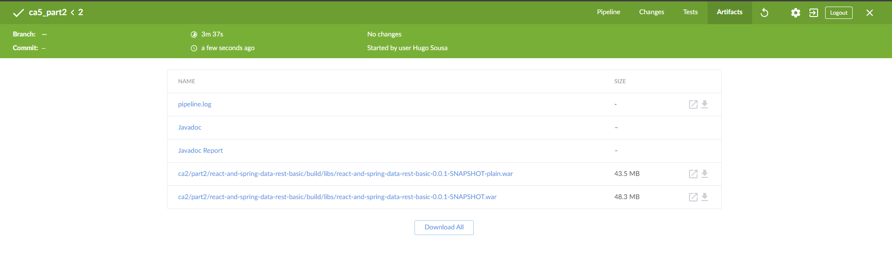
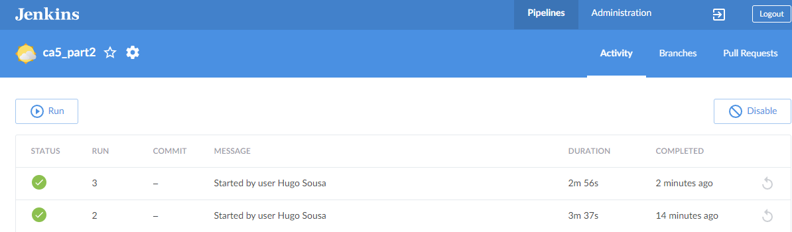

# Class Assignment 5

## Introduction:
On the fifth class assignment, we will be using Jenkins to automate the process of building and testing a software 
project. We will create a Jenkins pipeline that checks out the project source code from a GitHub repository, prepares 
the environment, assembles the project, runs tests, and archives the test results and built artifacts. We will also
create a Docker image of the project and push it to Docker Hub. The pipeline will be divided into stages, each
representing a step in the software development lifecycle. We will also use Docker Compose to set up a multi-container
environment for Jenkins with Docker-in-Docker (dind).


## Table of Contents
1. [Setting up the containers](#setting-up-the-containers)
2. [Ca5_part1](#ca5_part1)
3. [Ca5_part2](#ca5_part2)
4. [Ca5_part2 with Docker Compose](#ca5_part2-with-docker-compose)

## Setting up the containers
Note: We will create a container for the docker and jenkins, and we will use the docker in docker (dind) approach.
1. Follow the jenkins and docker tutorial at: https://www.jenkins.io/doc/book/installing/docker/;

2. Open docker application;

3. Create a bridge network in Docker:
```powershell
docker network create jenkins
```
4. This example will be on done on a Windows powershell, we will start by creating a docker container:
```powershell
   docker run --name jenkins-docker --rm --detach `
   --privileged --network jenkins --network-alias docker `
   --env DOCKER_TLS_CERTDIR=/certs `
   --volume jenkins-docker-certs:/certs/client `
   --volume jenkins-data:/var/jenkins_home `
   --publish 2376:2376 `
   docker:dind
```
Note: The command runs a privileged Docker-in-Docker container named jenkins-docker in detached mode, connected to the 
jenkins network with specific environment variables and volumes, and publishes port 2376.

5. To create a Jenkins container, in notepad, create a new file with the following contents: 
```Dockerfile
FROM jenkins/jenkins:2.452.2-jdk17
USER root
RUN apt-get update && apt-get install -y lsb-release
RUN curl -fsSLo /usr/share/keyrings/docker-archive-keyring.asc \
  https://download.docker.com/linux/debian/gpg
RUN echo "deb [arch=$(dpkg --print-architecture) \
  signed-by=/usr/share/keyrings/docker-archive-keyring.asc] \
  https://download.docker.com/linux/debian \
  $(lsb_release -cs) stable" > /etc/apt/sources.list.d/docker.list
RUN apt-get update && apt-get install -y docker-ce-cli
USER jenkins
RUN jenkins-plugin-cli --plugins "blueocean docker-workflow"
   ```
Note: This Dockerfile sets up a Jenkins container with version 2.452.2-jdk17, installs Docker CLI and necessary 
dependencies as root, switches to the Jenkins user, and installs the Blue Ocean and Docker Workflow Jenkins plugins.

6. Next, build the docker image:
```powershell
docker build -t myjenkins-blueocean:2.452.2-1 .
```

7. Run the docker image:
```powershell
docker run --name jenkins-blueocean --restart=on-failure --detach `
  --network jenkins --env DOCKER_HOST=tcp://docker:2376 `
  --env DOCKER_CERT_PATH=/certs/client --env DOCKER_TLS_VERIFY=1 `
  --volume jenkins-data:/var/jenkins_home `
  --volume jenkins-docker-certs:/certs/client:ro `
  --publish 8080:8080 --publish 50000:50000 myjenkins-blueocean:2.452.2-1
```
8. Open the browser and go to localhost:8080, which will open the Jenkins page;

9. Open DockerDesktop, and view to password for Jenkins;

10. Copy the password and paste it in the Jenkins page and click on continue;

11. Install the suggested plugins and create an admin user;

13. Go to Manage Jenkins and ensure the JSON path API plugin is installed.

14. Visit the the credential page and add a new credential, insert your DockerHub username and password and define an ID

# Ca5_part1
Note: On this part we will create a Jenkins pipeline that automates the process of building and testing a software
project. We will use ca2/part1/gradle_basic_demo as the project to be built and tested.

15. Go back to the dashboard and click on New Item, name it as "ca5_part1" and select Pipeline.

16. On the pipeline section, select the pipeline script from SCM, and insert the repository URL;

17. On the branch specification, ensure your main branch is selected, in this case its master;

18. Save the pipeline.

19. On the ca5_part1 directory create a new Jenkinsfile with the following content:
```groovy
pipeline {
    agent any

    stages {
        stage('Checkout') {
            steps {
                echo 'Checking out...'
                script {
                    git 'https://github.com/hugosousa1231830/devops-23-24-JPE-PSM-1231830.git'
                }
            }
        }

        stage('Prepare Environment') {
            steps {
                echo 'Setting file permissions...'
                dir('ca2/part1/gradle_basic_demo/') {
                    sh 'chmod +x ./gradlew'
                }
            }
        }

        stage('Assemble') {
            steps {
                dir('ca2/part1/gradle_basic_demo/') {
                    sh './gradlew assemble'
                }
            }
        }

        stage('Test') {
            steps {
                dir('ca2/part1/gradle_basic_demo/') {
                    sh './gradlew test'
                    junit 'build/test-results/test/*.xml'
                }
            }
            post {
                always {
                    dir('ca2/part1/gradle_basic_demo/') {
                        archiveArtifacts 'build/test-results/test/*.xml'
                    }
                }
            }
        }

        stage('Archive') {
            steps {
                dir('ca2/part1/gradle_basic_demo/') {
                    archiveArtifacts artifacts: 'build/*.jar', allowEmptyArchive: true
                }
            }
        }
    }
}
```
Note: This Jenkins pipeline script automates the process of building and testing a software project. It first checks 
out the project source code from a GitHub repository. Next, it prepares the environment by setting executable 
permissions on the Gradle wrapper script. It then assembles the project using Gradle. After assembling, it runs the 
tests and publishes the test results as JUnit reports, archiving these results. Finally, it archives the built JAR 
files, allowing for an empty archive if no JAR files are present.

20. To run the pipeline, click on Build Now.

21. To view the results, click on the build number and view the console output.

# Ca5_part2
Note: On this part we will create a Jenkins pipeline that automates the process of building, testing, and deploying a
Java-based web application. We will use ca2/part2/react-and-spring-data-rest-basic as the project to be built and tested.

1. Create a new item and name it as "ca5_part2" and select pipeline;

2. On the pipeline section, select the pipeline script from SCM, and insert the repository URL;

3. On the branch specification, ensure your main branch is selected, in this case its master;

4. Save the pipeline.

5. On the ca5_part2 directory create a new Jenkinsfile with the following content:
```groovy
pipeline {
    agent any

    environment {
        DOCKER_CREDENTIALS_ID = 'DHCRED'
        DOCKER_IMAGE = "hugosousaw/ca5part2:${env.BUILD_ID}"
    }

    stages {
        stage('Checkout') {
            steps {
                git 'https://github.com/hugosousa1231830/devops-23-24-JPE-PSM-1231830.git'
            }
        }

        stage('Assemble') {
            steps {
                dir('ca2/part2/react-and-spring-data-rest-basic') {
                    sh 'chmod +x ./gradlew'
                    sh './gradlew clean assemble'
                }
            }
        }

        stage('Test') {
            steps {
                dir('ca2/part2/react-and-spring-data-rest-basic') {
                    sh './gradlew test'
                }
            }
            post {
                always {
                    junit 'ca2/part2/react-and-spring-data-rest-basic/build/test-results/test/*.xml'
                }
            }
        }

        stage('Javadoc') {
            steps {
                dir('ca2/part2/react-and-spring-data-rest-basic') {
                    sh './gradlew javadoc'
                }
            }
            post {
                always {
                    publishHTML(target: [
                            allowMissing         : false,
                            alwaysLinkToLastBuild: false,
                            keepAll              : true,
                            reportDir            : 'ca2/part2/react-and-spring-data-rest-basic/build/docs/javadoc',
                            reportFiles          : 'index.html',
                            reportName           : 'Javadoc'
                    ])
                }
            }
        }

        stage('Archive') {
            steps {
                archiveArtifacts artifacts: 'ca2/part2/react-and-spring-data-rest-basic/build/libs/*.war', fingerprint: true
            }
        }

        stage('Build Docker Image') {
            steps {
                echo 'Building Docker image...'
                dir('ca2/part2/react-and-spring-data-rest-basic') {
                    // Copy the WAR file into the Docker build context
                    sh 'cp build/libs/react-and-spring-data-rest-basic-0.0.1-SNAPSHOT.war .'

                    // Dynamically generate Dockerfile
                    script {
                        def dockerfileContent = """
                        FROM tomcat:10.0.20-jdk17-temurin

                        COPY *.war /usr/local/tomcat/webapps/
                        """
                        writeFile file: 'Dockerfile', text: dockerfileContent
                    }

                    // Build Docker image using Dockerfile
                    script {
                        docker.build("${DOCKER_IMAGE}")
                    }
                }
            }
        }

        stage('Push Docker Image') {
            steps {
                echo 'Pushing Docker image to Docker Hub...'
                script {
                    docker.withRegistry('https://index.docker.io/v1/', DOCKER_CREDENTIALS_ID) {
                        docker.image("${DOCKER_IMAGE}").push()
                    }
                }
            }
        }

        stage('Publish Javadoc') {
            steps {
                echo 'Publishing Javadoc...'
                dir('ca2/part2/react-and-spring-data-rest-basic') {
                    publishHTML target: [
                            allowMissing: true, // Allow missing files to debug
                            alwaysLinkToLastBuild: true,
                            keepAll: true,
                            reportDir: 'build/docs/javadoc',
                            reportFiles: 'index.html',
                            reportName: 'Javadoc Report'
                    ]
                }
            }
        }
    }
}
```
Note: This Jenkins pipeline script automates the process of building, testing, and deploying a Java-based web 
application. It checks out the source code from a GitHub repository, assembles the project using Gradle, runs unit 
tests, and generates Javadoc documentation. Test results are published, and the application's WAR file is archived. A 
Docker image is built using the generated WAR file and then pushed to Docker Hub. Finally, the Javadoc is published as 
an HTML report.



# Ca5_part2 with Docker Compose
Note: On this part we will use Docker Compose to set up a multi-container environment for Jenkins with Docker-in-Docker
(dind). This approach simplifies the setup and management of the Jenkins and Docker containers, enabling secure and
persistent interaction between them.

1. Create a new Dockerfile in the ca5/part2_withDockerCompose, similar to the one below:
```Dockerfile
FROM jenkins/jenkins:2.452.2-jdk17
USER root
RUN apt-get update && apt-get install -y lsb-release
RUN curl -fsSLo /usr/share/keyrings/docker-archive-keyring.asc \
  https://download.docker.com/linux/debian/gpg
RUN echo "deb [arch=$(dpkg --print-architecture) \
  signed-by=/usr/share/keyrings/docker-archive-keyring.asc] \
  https://download.docker.com/linux/debian \
  $(lsb_release -cs) stable" > /etc/apt/sources.list.d/docker.list
RUN apt-get update && apt-get install -y docker-ce-cli
USER jenkins
RUN jenkins-plugin-cli --plugins "blueocean docker-workflow"
```
This Dockerfile customizes a Jenkins image to include Docker CLI capabilities, enabling Jenkins to interact with Docker 
containers. It starts with the jenkins/jenkins:2.452.2-jdk17 base image and switches to the root user to perform 
necessary administrative tasks. The file updates the package list and installs the lsb-release package to gather 
distribution information. It then adds Docker's official GPG key and sets up the Docker repository in the system's 
sources list. After updating the package list again, it installs the Docker CLI. The user is then switched back to 
jenkins, and the Jenkins plugin CLI is used to install the "blueocean" and "docker-workflow" plugins, equipping Jenkins 
with enhanced UI and Docker pipeline capabilities.

2. Create the docker-compose file in the ca5/part2_withDockerCompose directory:
```yaml
version: '3'

services:

  docker:
    container_name: docker
    image: docker:dind
    restart: always
    privileged: true
    networks:
      - jenkins
    environment:
      - DOCKER_TLS_CERTDIR=/certs
    volumes:
      - jenkins-docker-certs:/certs/client
      - jenkins-data:/var/jenkins_home
    ports:
      - "2376:2376"

  jenkins-blueocean:
    container_name: jenkins-blueocean
    build:
      context: .
      dockerfile: Dockerfile
    restart: on-failure
    networks:
      - jenkins
    environment:
      - DOCKER_HOST=tcp://docker:2376
      - DOCKER_CERT_PATH=/certs/client
      - DOCKER_TLS_VERIFY=1
    volumes:
      - jenkins-data:/var/jenkins_home
      - jenkins-docker-certs:/certs/client:ro
    ports:
      - "8080:8080"
      - "50000:50000"

networks:
  jenkins:
    driver: bridge

volumes:
  jenkins-data:
    external:
      name: jenkins-data  # Use existing volume named 'jenkins-data'
  jenkins-docker-certs:
    external:
      name: jenkins-docker-certs  # Use existing volume named 'jenkins-docker-certs'
```
Note:
This Docker Compose file configures a multi-container environment for Jenkins with Docker-in-Docker (dind). It defines 
two services: docker, which runs a privileged Docker daemon using the docker:dind image, and jenkins-blueocean, which 
builds and runs a Jenkins Blue Ocean instance from a Dockerfile in the current directory. Both services are connected 
via a custom bridge network named jenkins. The docker service is configured with volumes for Docker TLS certificates 
and Jenkins data, and publishes port 2376 for Docker communication. The jenkins-blueocean service is set up to use the 
Docker daemon for building and deploying applications, with volumes mounted for Jenkins home directory and Docker TLS 
certificates, and exposes ports 8080 and 50000. The configuration ensures that Jenkins can interact with the Docker 
daemon securely and persistently.

3. Utilize docker-compose to build the containers:
```powershell
docker-compose up 
```

4. Open the browser and go to localhost:8080, which will open the Jenkins page;

5. Run the ca5_part2 pipeline and view the results.


This concludes Ca5.